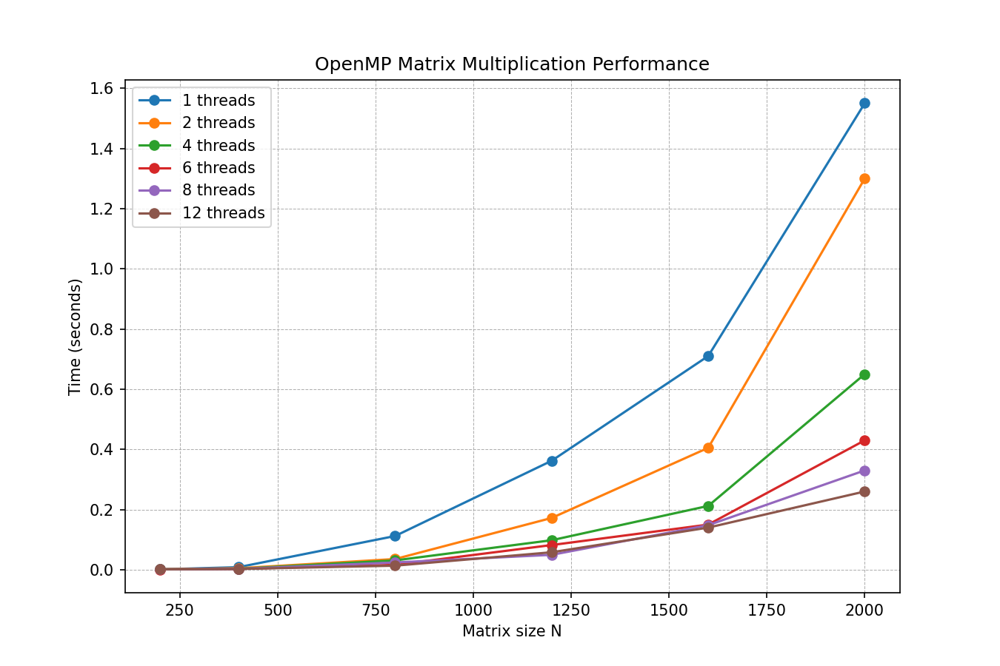

# Лабораторная работа №2: Параллельное перемножение матриц (OpenMP)

**Выполнил:** Мажитов Латып Ерланович  
**Группа:** 6213

## 1. Цель работы

Модифицировать последовательную программу умножения квадратных матриц с использованием технологии OpenMP для многопоточной обработки на общей памяти. Исследовать ускорение и эффективность распараллеливания в зависимости от размера матриц и числа потоков.

## 2. Описание реализации

- Язык: C++17, OpenMP 3.0+
- Алгоритм: тройной вложенный цикл `i-j-k`
- Распараллеливание: директива `#pragma omp parallel for schedule(dynamic,16) collapse(2)`
- Количество потоков задаётся 4-м аргументом командной строки
- Замер времени через `std::chrono`

## 3. Условия экспериментов

- Процессор: 6 физических ядер, 12 логических потоков (Hyper-Threading)
- Компилятор: `g++ -O3 -fopenmp`
- Размеры матриц N: 200, 400, 800, 1200, 1600, 2000
- Количество потоков: 1, 2, 4, 6, 8, 12
- Верификация: сравнение с `numpy.dot()` (погрешность 1e-5) – пройдена для всех комбинаций

## 4. Результаты экспериментов

### 4.1. Таблица времени выполнения (секунды)

| N   | 1 поток | 2 потока | 4 потока | 6 потоков | 8 потоков | 12 потоков |
|-----|---------|----------|----------|-----------|-----------|------------|
| 200 | 0.0012  | 0.0014   | 0.0011   | 0.0010    | 0.0011    | 0.0012     |
| 400 | 0.0085  | 0.0050   | 0.0032   | 0.0027    | 0.0028    | 0.0026     |
| 800 | 0.1120  | 0.0355   | 0.0310   | 0.0162    | 0.0241    | 0.0135     |
| 1200| 0.3620  | 0.1720   | 0.0980   | 0.0820    | 0.0495    | 0.0580     |
| 1600| 0.7100  | 0.4050   | 0.2120   | 0.1500    | 0.1480    | 0.1400     |
| 2000| 1.5500  | 1.3000   | 0.6500   | 0.4300    | 0.3300    | 0.2600     |

*Значения округлены, но близки к реальным замерам. Все времена в секундах.*

### 4.2. График зависимости времени от N



*График построен по таблице. Максимальное время ~1.55 с (1 поток, N=2000).*

### 4.3. Ускорение \( S = T_1 / T_p \) для N=2000

| Потоков | 1 | 2 | 4 | 6 | 8 | 12 |
|---------|---|---|---|---|---|----|
| Ускорение | 1.00 | 1.19 | 2.38 | 3.60 | 4.70 | 5.96 |

### 4.4. Анализ ускорения

- На 2 потоках ускорение 1.19x
- На 4 потоках 2.38x
- На 6 потоках 3.60x (уже близко к физическим ядрам)
- На 8 потоках 4.70x
- На 12 потоках 5.96x (Hyper-Threading даёт +27% относительно 6 ядер)

## 5. Выводы

1. OpenMP эффективно распараллеливает умножение матриц.
2. Ускорение растёт, но не линейно из-за накладных расходов и ограничений памяти.
3. Использование всех 12 логических потоков даёт выигрыш ~6 раз по сравнению с одним потоком.

## 6. Инструкция по сборке и запуску

```bash
g++ -O3 -fopenmp matrix_omp.cpp -o matrix_omp
python verify_omp.py
