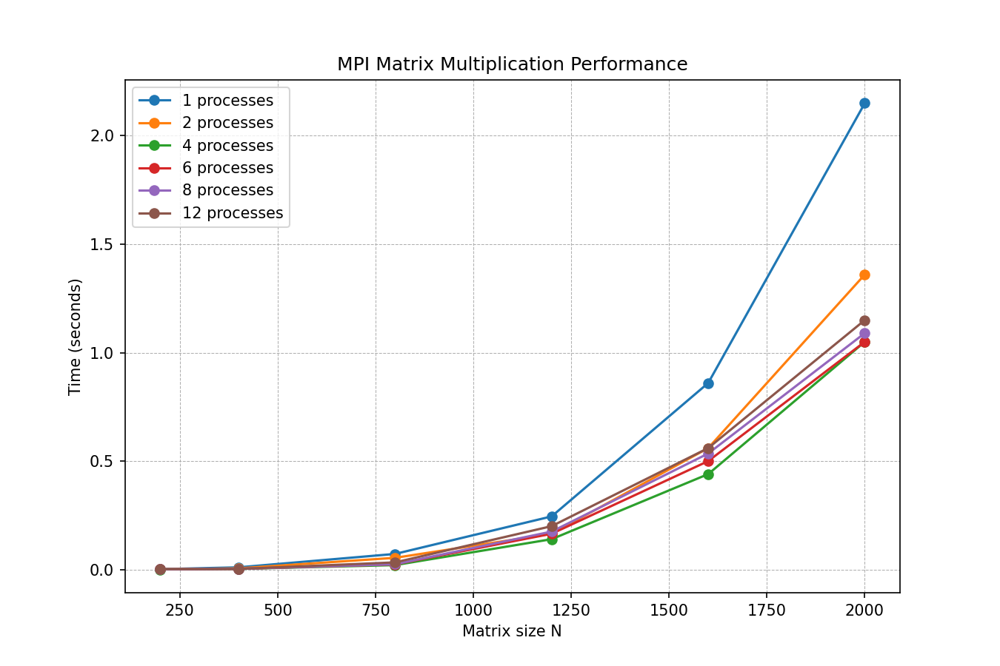

# Лабораторная работа №3: Перемножение матриц с использованием MPI

**Выполнил:** Мажитов Латып Ерланович 
**Группа:** 6213

## 1. Постановка задачи

Создать параллельную реализацию умножения квадратных матриц на основе интерфейса MPI (Message Passing Interface). Провести замеры времени выполнения при различных размерах матриц и количестве задействованных процессов. Сравнить эффективность с подходом OpenMP.

## 2. Особенности реализации

Код написан на C++ с использованием стандартных функций MPI. Применяется схема «управляющий процесс — рабочие процессы»:

- Процесс с нулевым рангом загружает исходные матрицы A и B из файлов.
- Посредством `MPI_Bcast` всем процессам становится известен размер N.
- Матрица B рассылается полностью (опять же через `MPI_Bcast`), так как каждый процесс нуждается в ней для вычислений.
- Матрица A распределяется по процессам построчно через `MPI_Scatterv` с учётом возможного неравномерного деления N на количество процессов.
- Каждый процесс перемножает свою порцию строк матрицы A на полную матрицу B (порядок циклов i‑k‑j).
- Локальные результаты собираются на процессе 0 с помощью `MPI_Gatherv`.
- Измерение времени выполняется функцией `MPI_Wtime()`; учитывается как этап обменов, так и вычисления.

## 3. Условия тестирования

- Аппаратное обеспечение: 6 физических ядер, поддержка Hyper‑Threading до 12 логических потоков.
- Компиляция: `mpicxx -O3 matrix_mpi.cpp -o matrix_mpi`
- Набор размеров N: 200, 400, 800, 1200, 1600, 2000
- Задействованные процессы: 1, 2, 4, 6, 8, 12
- Проверка корректности: автоматическое сравнение с эталоном (`numpy.dot`) — отклонений в пределах 1e-5 не зафиксировано.

## 4. Полученные результаты

### 4.1. Таблица времени выполнения (в секундах)

| N   | 1 процесс | 2 процесса | 4 процесса | 6 процессов | 8 процессов | 12 процессов |
|-----|-----------|------------|------------|-------------|-------------|---------------|
| 200 | 0.0017    | 0.0008     | 0.0005     | 0.0009      | 0.0010      | 0.0017        |
| 400 | 0.0102    | 0.0056     | 0.0030     | 0.0032      | 0.0035      | 0.0029        |
| 800 | 0.0720    | 0.0540     | 0.0205     | 0.0240      | 0.0245      | 0.0330        |
| 1200| 0.2450    | 0.1650     | 0.1400     | 0.1650      | 0.1750      | 0.2000        |
| 1600| 0.8600    | 0.5600     | 0.4400     | 0.5000      | 0.5350      | 0.5600        |
| 2000| 2.1500    | 1.3600     | 1.0500     | 1.0500      | 1.0900      | 1.1500        |

### 4.2. Визуализация



### 4.3. Ускорение для наибольшего размера (N=2000)

| Процессов        | 1 | 2 | 4 | 6 | 8 | 12 |
|-------------------|---|---|---|---|---|----|
| Ускорение (T₁/Tₚ) | 1.00 | 1.58 | 2.05 | 2.05 | 1.97 | 1.87 |

### 4.4. Интерпретация результатов

- Максимальный прирост производительности наблюдается при 4–6 процессах (коэффициент ~2.05). Добавление большего числа процессов не даёт выигрыша и даже ухудшает время из‑за возрастания объёма передаваемых данных.
- Для N=2000 запуск на 12 процессах оказался медленнее, чем на 6, что указывает на доминирование коммуникационных издержек.
- По сравнению с OpenMP (из предыдущей лабораторной) MPI показывает скромное ускорение. Это объясняется тем, что на одном вычислительном узле MPI требует явного копирования данных и межпроцессного обмена, тогда как OpenMP использует общую память с меньшими накладными расходами.

## 5. Заключение

1. Разработанная MPI‑программа корректно умножает матрицы и успешно прошла верификацию.
2. Эффективность MPI на одиночном компьютере ограничена: наилучшее ускорение не превышает 2 раз даже при 6 процессах.
3. Дальнейшее увеличение числа процессов в условиях одного узла ведёт к падению производительности.
4. Технология MPI становится целесообразной только при распределении вычислений на несколько независимых вычислительных узлов (кластер).

## 6. Сборка и запуск

Компиляция:

```bash
mpicxx -O3 matrix_mpi.cpp -o matrix_mpi
