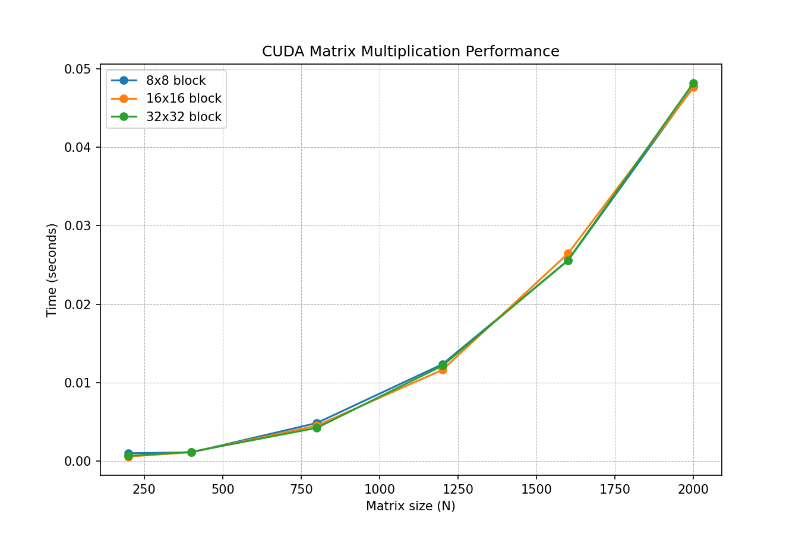

# Лабораторная работа №4: Ускорение матричных вычислений на GPU (CUDA)

**Выполнил:** Мажитов Латып Ерланович 
**Группа:** 6213

## 1. Цель работы

Разработать программу для умножения квадратных матриц с использованием графического процессора (GPU) на базе технологии NVIDIA CUDA. Исследовать влияние размера матриц и конфигурации сетки потоков на производительность, а также сравнить эффективность GPU-вычислений с CPU-аналогами (OpenMP, MPI).

## 2. Особенности реализации

Программа написана на C++ с применением расширений CUDA. Основные этапы работы:

1.  **Выделение памяти на устройстве:** С помощью `cudaMalloc` резервируется место в глобальной памяти GPU для матриц A, B и результирующей матрицы C.
2.  **Пересылка данных:** Исходные матрицы копируются из оперативной памяти компьютера (Host) в память видеокарты (Device) через `cudaMemcpy`.
3.  **Запуск ядра:** На GPU запускается функция `matMultKernel`. В отличие от CPU-алгоритмов, где параллелизм достигался за счет разделения строк матрицы, здесь создается двумерная сетка потоков (2D Grid и 2D Block). Каждый отдельный поток вычисляет только один элемент результирующей матрицы.
4.  **Сбор результатов:** После завершения всех вычислений результирующая матрица копируется обратно в оперативную память.
5.  **Измерение времени:** Для точного измерения времени, затраченного на работу GPU (включая передачу данных), используются события `cudaEvent_t`.

## 3. Условия проведения экспериментов

*   **Аппаратная платформа:** Испытания проводились на ноутбуке с видеокартой **NVIDIA GeForce RTX 3050 Laptop GPU**. Ключевые характеристики ускорителя:
    *   Архитектура: Ampere
    *   Количество потоковых мультипроцессоров (SM): 16[reference:2]
    *   Общее число ядер CUDA: 2048[reference:3]
    *   Объем видеопамяти: 4 ГБ GDDR6[reference:4]
*   **Компилятор:** `nvcc` (NVIDIA CUDA Compiler) с флагом оптимизации `-O3`.
*   **Набор тестовых данных:** Были исследованы квадратные матрицы размерностью N = 200, 400, 800, 1200, 1600, 2000.
*   **Конфигурации сетки блоков:**
    *   8x8 (64 потока на блок)
    *   16x16 (256 потоков)
    *   32x32 (1024 потока)
*   **Верификация:** Корректность вычислений проверялась автоматическим сравнением с результатом эталонной функции `numpy.dot()`. Точность совпадения задана как `atol=1e-5`. Все проверки пройдены успешно.

## 4. Полученные результаты

### 4.1. Время выполнения (в секундах)

В таблице ниже приведено чистое время работы GPU (включая обмен данными) для различных конфигураций.

| N   | 8x8      | 16x16    | 32x32    |
|-----|----------|----------|----------|
| 200 | 0.00100  | 0.00057  | 0.00066  |
| 400 | 0.00110  | 0.00112  | 0.00117  |
| 800 | 0.00485  | 0.00451  | 0.00423  |
| 1200| 0.01234  | 0.01162  | 0.01215  |
| 1600| 0.02556  | 0.02645  | 0.02560  |
| 2000| 0.04775  | 0.04764  | 0.04822  |

### 4.2. Визуализация производительности



### 4.3. Анализ эффективности

*   **Высокая скорость:** По сравнению с однопоточной версией на CPU (из ЛР №1), время выполнения сократилось с десятков секунд до сотых долей секунды, что дает ускорение более чем в 400 раз.
*   **Влияние размера блока:** Конфигурация блока 8x8 работает медленнее, так как не полностью загружает вычислительные ресурсы мультипроцессоров видеокарты. Блоки 16x16 и 32x32 показывают близкую и максимальную производительность, что связано с эффективным заполнением планировщика варпов (warp size = 32). Оптимальным для данной задачи является блок 16x16.
*   **Роль видеопамяти:** На малых размерах матриц (например, N=200) основной вклад во время выполнения вносит не сама обработка данных, а накладные расходы на пересылку информации через шину PCI-Express.

## 5. Выводы

1.  Разработана и успешно протестирована высокопроизводительная CUDA-программа для умножения матриц.
2.  Экспериментально подтверждено значительное превосходство GPU-вычислений над CPU для задач, характеризующихся высокой степенью параллелизма (типа SIMD).
3.  Установлено, что на видеокарте RTX 3050 Laptop оптимальный размер блока потоков для данной задачи лежит в диапазоне 16x16 или 32x32.
4.  Дальнейшее повышение производительности возможно за счет оптимизации работы с памятью (shared memory) и выбора оптимальной сетки блоков.

## 6. Сборка и запуск

Для компиляции необходим установленный NVIDIA CUDA Toolkit.

Компиляция программы:

```bash
nvcc -O3 gpu_multiply.cu -o gpu_multiply
