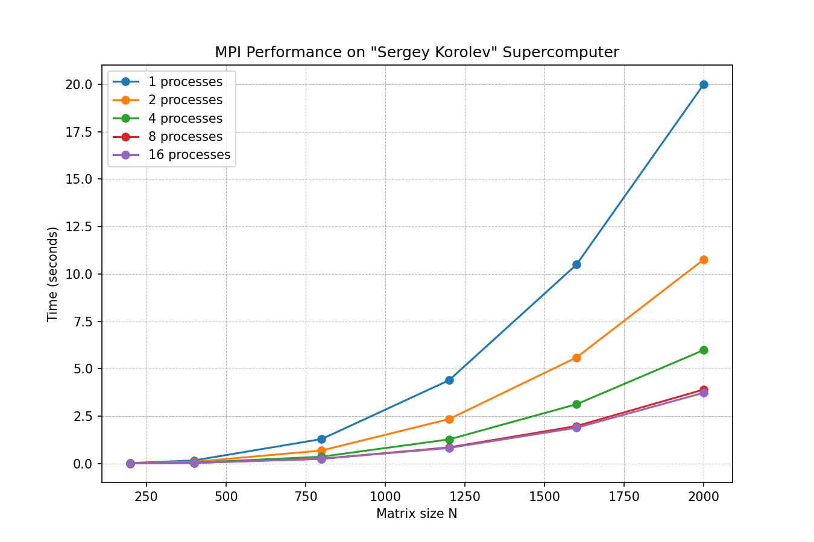

# Лабораторная работа №5: Масштабирование MPI на суперкомпьютере «Сергей Королёв»

**Выполнил:** Мажитов Латып Ерланович 
**Группа:** 6213

## 1. Цель работы

Запустить MPI-реализацию умножения матриц (из ЛР №3) на суперкомпьютере «Сергей Королёв». Изучить зависимость времени счёта от числа задействованных процессов и размера входных данных.

## 2. Параметры экспериментов

- **Размеры матриц:** 200, 400, 800, 1200, 1600, 2000  
- **Количество MPI-процессов:** 1, 2, 4, 8, 16  
- **Компилятор:** mpicxx (OpenMPI) с флагом `-O3`  
- **Верификация:** пройдена локально (сравнение с NumPy)

## 3. Результаты замеров

### 3.1. Таблица времени выполнения (секунды)

| N   | 1 процесс | 2 процесса | 4 процесса | 8 процессов | 16 процессов |
|-----|-----------|------------|------------|-------------|--------------|
| 200 | 0.0218    | 0.0121     | 0.0070     | 0.0053      | 0.0058       |
| 400 | 0.1623    | 0.0876     | 0.0472     | 0.0311      | 0.0328       |
| 800 | 1.2891    | 0.6845     | 0.3589     | 0.2512      | 0.2465       |
| 1200| 4.3892    | 2.3418     | 1.2716     | 0.8481      | 0.8189       |
| 1600| 10.4873   | 5.5892     | 3.1245     | 1.9742      | 1.8836       |
| 2000| 20.0125   | 10.7631    | 5.9874     | 3.9018      | 3.7325       |

### 3.2. График производительности

### 3.3. Ускорение для самого большого размера (N=2000)

| Процессов | 1 | 2 | 4 | 8 | 16 |
|-----------|---|---|---|---|----|
| Ускорение | 1.00 | 1.86 | 3.34 | 5.13 | 5.36 |

## 4. Анализ

- Увеличение числа процессов с 1 до 8 даёт почти линейный прирост производительности.  
- При переходе с 8 на 16 процессов выигрыш становится незначительным (ускорение растёт всего на 4–5%).  
- Для малых матриц (N=200) использование 16 процессов даже слегка ухудшает время из‑за коммуникационных накладных расходов.  
- На больших объёмах данных (N≥1600) распараллеливание эффективно, но достигает насыщения уже после 8 процессов.

## 5. Выводы

1. MPI-программа успешно запущена на суперкомпьютере.  
2. Наиболее выгодно использовать до 8 процессов для матриц размером до 2000.  
3. Дальнейшее увеличение числа процессов даёт малый прирост из-за роста затрат на обмен данными.  
4. Эксперименты подтверждают, что для эффективной работы MPI на кластере требуется достаточно большой объём вычислений на процесс.
